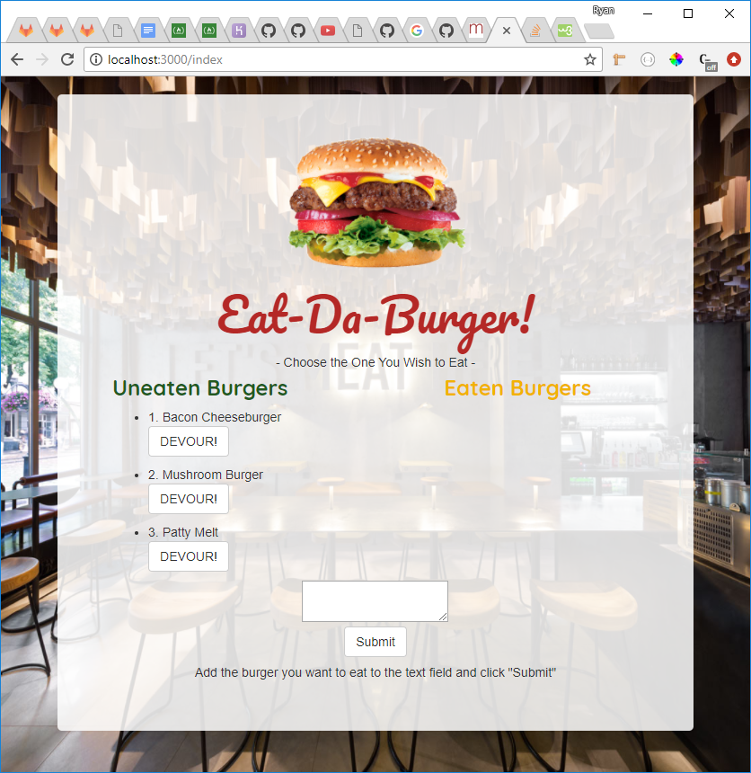
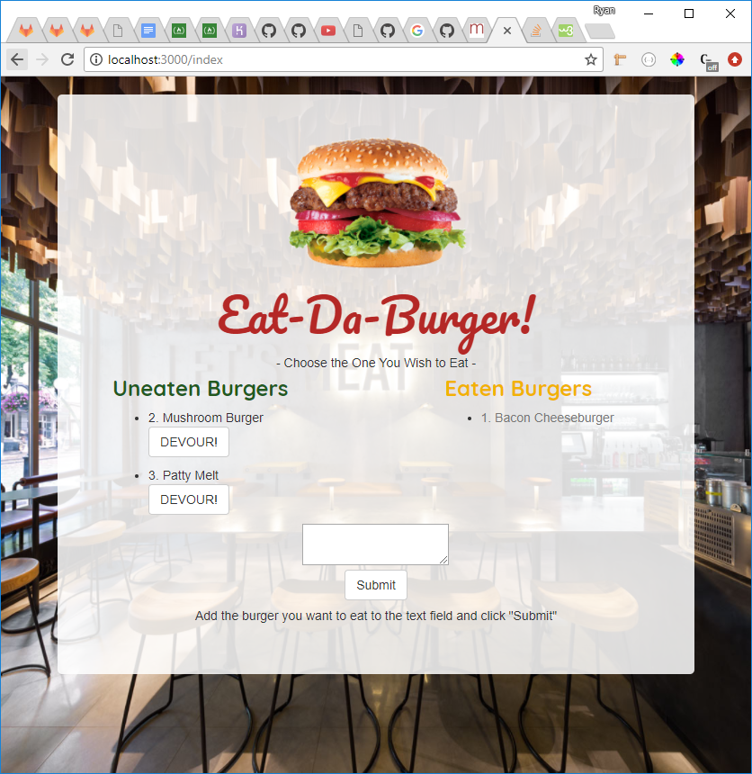
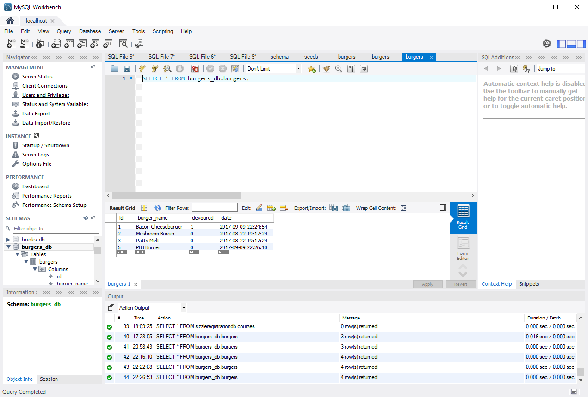
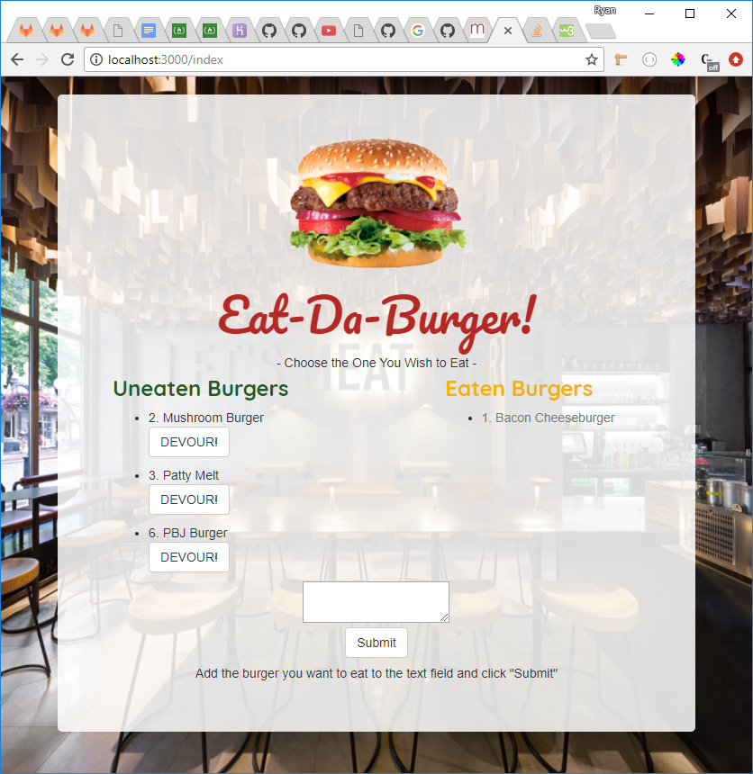

# Eat-Da-Burger

Eat-Da-Burger - The full-stack web app where you click to devour the burgers you create. Featuring the ability to display a list of burgers in a MySQL database, create new burgers that are added to the database, and eat the burgers in the database that effectively changes their state in the database.

- Tech Used -

HTML, CSS, Bootstrap, Handlebars, MySQL, JawsDB, Node.js, Express, Heroku.

- NPM Modules Needed -

body-parser
express
express-handlebars
method-override
mysql

- To Use App - 

Go to: https://shrouded-shelf-44257.herokuapp.com/index and follow the instructions below.

- Eat-Da-Burger Process -

The initial screen shown  when following the URL is populated by information from the database. Each burger entry has a button under it that, when clicked, changes the state of the burger entry to devoured (true).

This moves the entry into the "Eaten Burgers" column.

If the user wants to create a new burger to "consume", they must first enter the new burger into the text field and then click the "Submit" button.

A new burger entry will then be made in the database.

The new burger will appear in the "Uneaten Burgers" column where it can then be "devoured".

A deceptively simple logger with a complex backend. Have fun making those burgers!